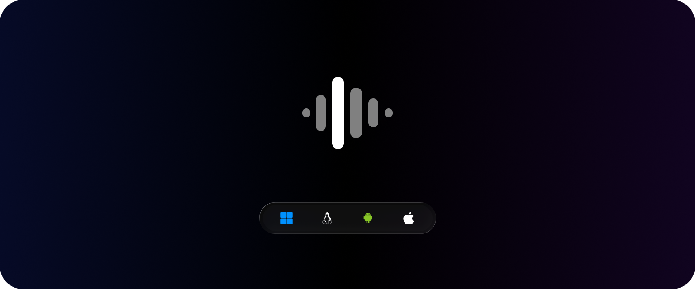
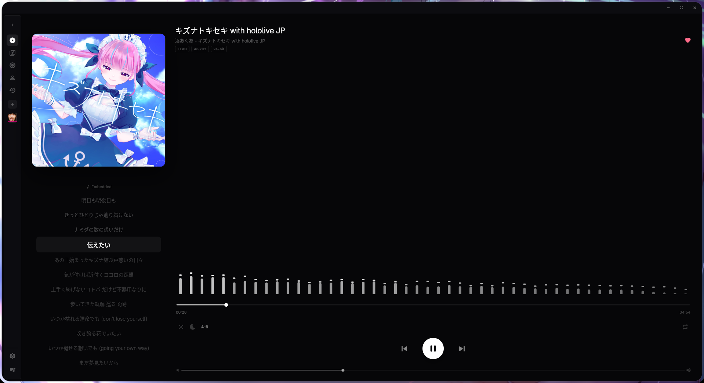
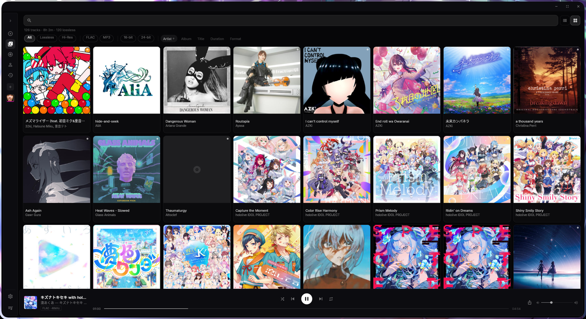
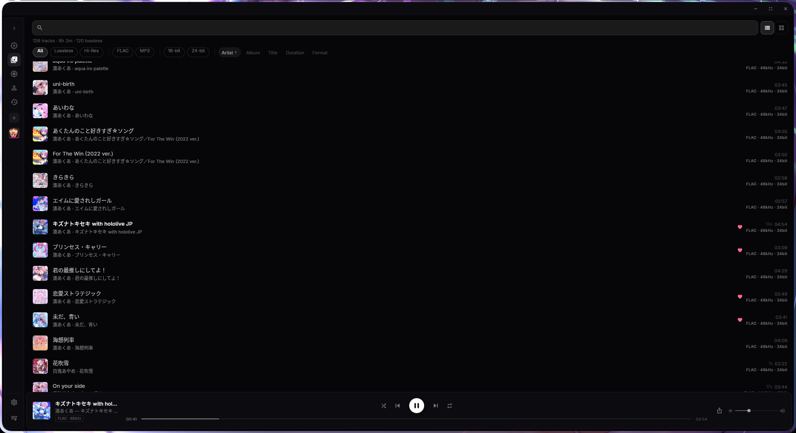

<div align="center">

[](https://github.com/nokarin-dev/aqloss/releases/latest)
[](LICENSE)
[](https://flutter.dev)
[](#download)

[](https://github.com/nokarin-dev/aqloss/releases)
[](https://flathub.org/apps/xyz.nokarin.aqloss)
[](https://github.com/nokarin-dev/aqloss/releases/latest)
[](https://github.com/nokarin-dev/aqloss/releases/nightly)

[](https://github.com/nokarin-dev/aqloss/actions/workflows/nightly.yml)
[](https://github.com/nokarin-dev/aqloss/actions/workflows/ci.yml)

</div>

---

> [!NOTE]
> Windows, Linux, and Android are the platforms I actually ship. macOS and iOS compile; I don't test them regularly.

On Windows, **WASAPI Exclusive** can send the stream straight to the device (no OS mixer). Linux can do the same on ALSA hardware (`hw:`). Volume, EQ, ReplayGain, and the rest of the DSP stay off in that mode - that's the point. Shared mode goes through the mixer. Bit-perfect still needs a DAC/driver that won't resample behind your back.

---

<details>
  <summary>
    <h2>In App Preview</h2>
  </summary>
  <p align="center">
   <h3>Playing Screen</h3>
    
    <h3>Library Screen - Grid</h3>
    
    <h3>Library Screen - Details</h3>
    
  </p>
</details>

---

## Formats

DSD (`.dsf` / `.dff`) is not supported. Symphonia has no DSD decoder, and I'm not adding a second path for it.
| Format | Extensions | Notes |
| --- | --- | --- |
| FLAC | `.flac` | lossless, up to 32-bit / 384 kHz |
| WAV / AIFF | `.wav` `.aiff` `.aif` | PCM |
| ALAC | `.m4a` | lossless |
| MP3 | `.mp3` | |
| AAC | `.aac` `.m4a` | |
| Vorbis | `.ogg` | |
| Opus | `.opus` | libopus via Symphonia adapter |
| WavPack | `.wv` | lossless |

---

## Download

GitHub [releases](https://github.com/nokarin-dev/aqloss/releases/latest) (Windows installer/portable, Linux `.deb` / `.rpm` / AppImage / tarball, Android APKs). Linux is also on [Flathub](https://flathub.org/apps/xyz.nokarin.aqloss).

A rolling [nightly](https://github.com/nokarin-dev/aqloss/releases/tag/nightly) from main has those plus unsigned macOS and iOS.

No AUR package yet. They closed new account registration, so I can't upload `aqloss-bin` until that opens again. Use GitHub or Flathub until then.

The Windows installer is not code-signed. SmartScreen will complain; More info → Run anyway.

macOS and iOS compile; I don't test them regularly. They only ship on nightly.

---

## Build

You need Flutter (stable) and Rust (stable). For codegen changes, also `cargo install flutter_rust_bridge_codegen`.

```bash
flutter pub get
flutter_rust_bridge_codegen generate # only if you touch the Rust API
```

```bash
flutter run -d windows
```

```bash
sudo apt install clang cmake ninja-build pkg-config libgtk-3-dev liblzma-dev \
  libasound2-dev libpulse-dev libayatana-appindicator3-dev
flutter run -d linux
```

```bash
flutter run -d android
```

---

## Last.fm / ListenBrainz

Both live under Settings → Integrations. Last.fm needs an API account because this repo is public and I don't ship a key - create one at [last.fm/api/account/create](https://www.last.fm/api/account/create) and paste it in settings. ListenBrainz uses your own user token.

Lua/webhook plugins: see [docs/plugin.md](docs/plugin.md).

---

## Support

- International: [Ko-fi](https://ko-fi.com/nokarin), [Buy Me a Coffee](https://www.buymeacoffee.com/nokarin), [Open Collective](https://opencollective.com/nokarin), [thanks.dev](https://thanks.dev/u/gh/nokarin-dev)
- Indonesia: [Trakteer](https://trakteer.id/nokarin), [Tako](https://tako.id/nokarin)

Also in Settings → Support.

---

## License

```
Aqloss
Copyright © 2025-2026 nokarin-dev

This program is free software: you can redistribute it and/or modify
it under the terms of the GNU General Public License as published by
the Free Software Foundation, either version 3 of the License, or
(at your option) any later version.

This program is distributed in the hope that it will be useful,
but WITHOUT ANY WARRANTY; without even the implied warranty of
MERCHANTABILITY or FITNESS FOR A PARTICULAR PURPOSE. See the
GNU General Public License for more details.

You should have received a copy of the GNU General Public License
along with this program. If not, see <https://www.gnu.org/licenses/>.
```